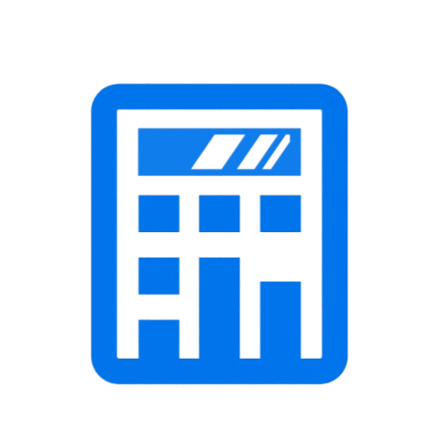

# StockSum

  

StockSum is a lightweight, high-performance Android application designed to streamline stock tracking. It brings together robust portfolio management, real-time market insights, and customizable price alerts into a single, seamless, and user-friendly interface.

## Features

- **Portfolio Management:** Keep track of your investments, total asset value, and real-time profit/loss metrics in one unified dashboard.
- **Market Insights:** Access updated stock prices, comprehensive charts, and major financial indicators to make informed trading choices.
- **Custom Price Alerts:** Set automated triggers and instant notifications for specific price milestones or volatile market shifts so you never miss a trade.
- **Minimalist UI:** Clean, intuitive layout designed for rapid performance, low idle consumption, and clear data presentation.

## Tech Stack

StockSum is built natively for Android utilizing a modern, functional, and efficient architecture:

- **Language:** 100% [Kotlin](https://kotlinlang.org/) for concise, safe, and asynchronous code execution.
- **UI Framework:** Jetpack Compose for building a modern, responsive, and declarative user interface.
- **Architecture:** MVVM (Model-View-ViewModel) pattern ensuring clean separation of concerns and maintainability.
- **Local Storage:** SQLite / Room Database for reliable caching, offline portfolio accessibility, and storage of user configurations.
- **Networking:** Retrofit & OkHttp for optimized, safe network requests and API communication.
- **Asynchrony:** Kotlin Coroutines & Flow for fluid, reactive UI updates and non-blocking background tasks.

## API References

Market data, asset metrics, and financial insights are fetched using industry-standard financial endpoints:

- **Primary Market Data:** Integrated via standard REST/WebSocket financial APIs (e.g., *Finnhub*, *Alpha Vantage*, or *Yahoo Finance*) to receive accurate price feeds and company profiles.
- **Data Serialization:** Parsed dynamically on-device to ensure optimized bandwidth usage and immediate UI rendering.

### Prerequisites

- Android Studio
- JDK 17+
- Android SDK 24+ (Android 7.0 or higher)
